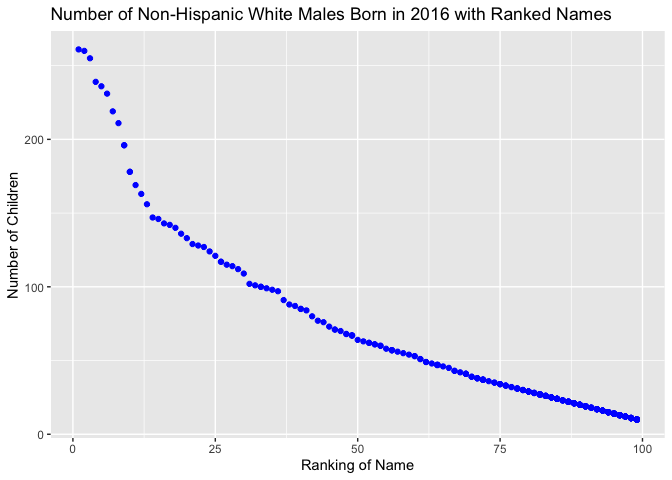

Homework 2
================
Troy Layouni
2019-09-20

The first step is to load the tidyverse
    package

``` r
library(tidyverse) 
```

    ## ── Attaching packages ───────────────────────────────────────────────────────────────────────────────── tidyverse 1.2.1 ──

    ## ✔ ggplot2 3.2.1     ✔ purrr   0.3.2
    ## ✔ tibble  2.1.3     ✔ dplyr   0.8.3
    ## ✔ tidyr   1.0.0     ✔ stringr 1.4.0
    ## ✔ readr   1.3.1     ✔ forcats 0.4.0

    ## ── Conflicts ──────────────────────────────────────────────────────────────────────────────────── tidyverse_conflicts() ──
    ## ✖ dplyr::filter() masks stats::filter()
    ## ✖ dplyr::lag()    masks stats::lag()

## Question 1

Reading in the Captain Trash Wheel data from the first excel sheet
titled “Mr. Trash Wheel” as well as:

  - Omitting non-data entries
  - Cleaning the names of variables
  - Omitting rows not including dumpster-specific data
  - Rounding the “Sports Ball” variable to the nearest integer and
    converting it to an integer variable using as.integer

<!-- end list -->

``` r
library(readxl)

trash_wheel_data = read_excel("./data/Trash-Wheel-Collection-Totals-8-6-19.xlsx",
  sheet = "Mr. Trash Wheel", 
  range = "A2:N408") %>% 
  janitor::clean_names() %>%
  drop_na(dumpster) %>% 
  mutate(sports_balls = as.integer(round(sports_balls)))
```

**Question 1, part 2: Reading in and cleaning precipitation data**

  - Omitting rows without data
  - Adding a year variable
  - Combining of both data on precipitation for 2017 and 2018
  - Converting the month number to a character variable for month name

Reading in and cleaning `2017 Precipitation`
sheet

``` r
precipitation_2017_data = read_excel("./data/Trash-Wheel-Collection-Totals-8-6-19.xlsx",
    sheet = "2017 Precipitation",
    range = "A2:B14") %>% 
    janitor::clean_names() %>%
    mutate(year = 2017) 
```

Reading in and cleaning `2018 Precipitation`
sheet

``` r
precipitation_2018_data = read_excel("./data/Trash-Wheel-Collection-Totals-8-6-19.xlsx",
    sheet = "2018 Precipitation",
    range = "A2:B14") %>% 
    janitor::clean_names() %>%
    mutate(year = 2018)    
```

Combining precipitation data for 2017 and 2018 and converting month into
a character variable

``` r
precipitation_data_full =
  bind_rows(precipitation_2017_data, precipitation_2018_data) %>% 
  mutate(month = month.name[month])
```

**Question 1, part 3: Describing the precipitation data**

The Captain Trash Wheel dataset, `trash_wheel_data` includes data on the
contents of each dumpster filled from 2014-2019. There are 3 columns in
this dataset, with information on debris collected such as plastic bags
and sports balls, with a median of 8 balls in each dumpster in 2017, as
well as information on dumpster volume and weight, which averaged
3.3375269 tons per dumpster in 2018, 3.1789091 tons in 2017, 3.2272549
tons in 2016, 3.3633803 tons in 2015, and 3.2125 tons in 2014. The
dataset also gives the number of homes that were powered by Captain
Trash Wheel. Data on precipitation in Baltimore, where Captain Trash
Wheel is located, was collected and combined into our dataset
`precipitation_data_full`, which includes 3 columns for the variables
month, year and total precipitation, and 24 rows, one for every month of
2017 and 2018. In 2017, Baltimore received a total of 32.93 inches of
precipitation and in 2018 received 70.33 inches. The mean monthly
precipitation for 2017 was 2.7441667 inches (standard deviation of
2.2229442 inches) and for 2018 the mean was 5.8608333 inches (standard
deviation of 3.1318233 inches).

## Question 2

**Question 2, part 1: cleaning politician party affiliation data
“pols-month” by:**

  - breaking up data variable into month, day, and year
  - creating a new variable called “president”
  - removing “day” variable
  - replacing month number with month name

<!-- end list -->

``` r
political_party_data = 
read_csv(file = "./data/fivethirtyeight_datasets/pols-month.csv") %>%
  separate(mon, sep = "-", into = c("year", "month", "day")) %>% 
  mutate(president = if_else(prez_dem < 1, "gop", "dem")) %>% 
  select(-day, -prez_dem, -prez_gop) %>% 
  mutate(month = month.name[(as.integer(month))]) %>% 
  mutate(year = as.numeric(year))
```

    ## Parsed with column specification:
    ## cols(
    ##   mon = col_date(format = ""),
    ##   prez_gop = col_double(),
    ##   gov_gop = col_double(),
    ##   sen_gop = col_double(),
    ##   rep_gop = col_double(),
    ##   prez_dem = col_double(),
    ##   gov_dem = col_double(),
    ##   sen_dem = col_double(),
    ##   rep_dem = col_double()
    ## )

**Question 2, part 2: cleaning the stock market index data by:**

  - breaking up data variable into month, day and year
  - replacing month number with month name
  - removing “day” variable
  - organize data according to year and month
  - arrange data so that year and month are the first columns

<!-- end list -->

``` r
stock_market_data = 
read_csv(file = "./data/fivethirtyeight_datasets/snp.csv") %>%
  janitor::clean_names() %>% 
  separate(date, sep = "/", into = c("month", "day", "year")) %>% 
  mutate(month = as.factor(month)) %>% 
  arrange(year, month) %>%
  select(-day, year, month, close) %>% 
  mutate(month = month.name[(as.integer(month))]) %>% 
  mutate(year = as.numeric(year))
```

    ## Parsed with column specification:
    ## cols(
    ##   date = col_character(),
    ##   close = col_double()
    ## )

**Question 2, part 3: tidying the unemployment data by:**

  - use pivot\_longer to create a month variable and percentage of
    unemployment variable
  - clean data

<!-- end list -->

``` r
unemployment_data = 
read_csv(file = "./data/fivethirtyeight_datasets/unemployment.csv") %>%
  janitor::clean_names() %>% 
  pivot_longer(jan:dec, names_to = "month", values_to = "unemploy_percent") %>% 
  mutate(month = recode(month, "jan" = "January", "feb" = "February", "mar" = "March", "apr" = "April", "jun" = "June", "jul" = "July", "aug" = "August", "sep" = "September", "oct" = "October", "nov" = "November", "dec" = "December")) %>% 
  mutate(year = as.numeric(year))
```

    ## Parsed with column specification:
    ## cols(
    ##   Year = col_double(),
    ##   Jan = col_double(),
    ##   Feb = col_double(),
    ##   Mar = col_double(),
    ##   Apr = col_double(),
    ##   May = col_double(),
    ##   Jun = col_double(),
    ##   Jul = col_double(),
    ##   Aug = col_double(),
    ##   Sep = col_double(),
    ##   Oct = col_double(),
    ##   Nov = col_double(),
    ##   Dec = col_double()
    ## )

**Question 2, part 4: Joining datasets by merging political\_party\_data
and stock\_market\_data, then merging unemployment into the result**

Merging `stock_market_data` into `political_party_data`

``` r
political_stock_data = 
  left_join(political_party_data, stock_market_data, by = c("year", "month"))
```

Merging `unemployment_data` into `political_stock_data`

``` r
fivethirtyeight_data = 
  left_join(political_stock_data, unemployment_data, by = c("year", "month"))
```

**Question 2, part 5: Summary of FiveThirtyEight data**

The dataset `political_party_data` contains rows of observations and
columns that includes variables for the number of democratic and
republican governors, senators, representatives and the political
affiliation of the president by month and year from 1947 to 2015. On
average there were 46 GOP senators and 54 Democratic senators over this
time. The dataset `stock_market_data` has rows of observations and
columns that includes variables `year`, `month`, and `close`, giving
stock market closing values between 1950 and 2015 by year and month

The FiveThirtyEight dataset, `fivethirtyeight_data` contains information
on political leaders party affiliation as well as stock market closing
values and unemployment rates by year and month. Variables like
`sen_dem` and `rep_gop` give the number of democratic senators and GOP
representatives, respectively, and `president` tells us the party
affiliation of the president of the United States (dem, or gop). This
data contains 11 rows, each representing different month and year in
history, and 822 columns. We can see that between 1947 and 2015,
unemployment (variable `unemploy_percent`) at its lowest was 2.5 % and
at its highest was 10.8%. We can also see that the mean closing value of
the Standard & Poor (S\&P) stock market index (variable `close`) over
this time period was 466.6689384.

## Question 3

**Question 3, part 1: Loading and tidying Popular baby names data by:**

  - removing duplicate rows
  - creating uniform case structure
  - creating consistent formatting for the ethnicity variable

<!-- end list -->

``` r
baby_names_data = 
read_csv(file = "./data/Popular_Baby_Names.csv") %>%
  janitor::clean_names() %>% 
  mutate(childs_first_name = str_to_upper(childs_first_name)) %>%
  mutate(ethnicity = recode(ethnicity, "ASIAN AND PACI" = "ASIAN AND PACIFIC ISLANDER", "BLACK NON HISP" = "BLACK NON HISPANIC", "WHITE NON HISP" = "WHITE NON HISPANIC")) %>% 
  distinct()
```

    ## Parsed with column specification:
    ## cols(
    ##   `Year of Birth` = col_double(),
    ##   Gender = col_character(),
    ##   Ethnicity = col_character(),
    ##   `Child's First Name` = col_character(),
    ##   Count = col_double(),
    ##   Rank = col_double()
    ## )

**Question 3, part 2: creating a table for rank in popularity of the
name Olivia for females over time**

``` r
baby_names_data %>%
  filter(childs_first_name == "OLIVIA", gender == "FEMALE") %>% 
  select(ethnicity, year_of_birth, rank) %>% 
  pivot_wider(
    names_from = "year_of_birth",
    values_from = "rank"
  ) %>% 
  knitr::kable(caption = "Popularity Rank of the Name Olivia by Ethnicity from 2011-2016")
```

| ethnicity                  | 2016 | 2015 | 2014 | 2013 | 2012 | 2011 |
| :------------------------- | ---: | ---: | ---: | ---: | ---: | ---: |
| ASIAN AND PACIFIC ISLANDER |    1 |    1 |    1 |    3 |    3 |    4 |
| BLACK NON HISPANIC         |    8 |    4 |    8 |    6 |    8 |   10 |
| HISPANIC                   |   13 |   16 |   16 |   22 |   22 |   18 |
| WHITE NON HISPANIC         |    1 |    1 |    1 |    1 |    4 |    2 |

Popularity Rank of the Name Olivia by Ethnicity from 2011-2016

**Question 3, part 3: creating a table for most popular boy’s name over
time**

``` r
baby_names_data %>%
  filter(rank == "1", gender == "MALE") %>% 
  select(ethnicity, year_of_birth, childs_first_name) %>% 
  pivot_wider(
    names_from = "year_of_birth",
    values_from = "childs_first_name"
  ) %>% 
  knitr::kable(caption = "Most Popular Male Name by Ethnicity from 2011-2016")
```

| ethnicity                  | 2016   | 2015   | 2014   | 2013   | 2012   | 2011    |
| :------------------------- | :----- | :----- | :----- | :----- | :----- | :------ |
| ASIAN AND PACIFIC ISLANDER | ETHAN  | JAYDEN | JAYDEN | JAYDEN | RYAN   | ETHAN   |
| BLACK NON HISPANIC         | NOAH   | NOAH   | ETHAN  | ETHAN  | JAYDEN | JAYDEN  |
| HISPANIC                   | LIAM   | LIAM   | LIAM   | JAYDEN | JAYDEN | JAYDEN  |
| WHITE NON HISPANIC         | JOSEPH | DAVID  | JOSEPH | DAVID  | JOSEPH | MICHAEL |

Most Popular Male Name by Ethnicity from 2011-2016

**Question 3, part 4: creating a scatter plot of the number white male
boys born in 2016 by rank of their respective names**

``` r
baby_names_data %>%
  filter(ethnicity == "WHITE NON HISPANIC", gender == "MALE", year_of_birth == "2016") %>% 
  ggplot(aes(x = rank, y = count)) +
  geom_point(color = "blue") +
  ggtitle("Number of Non-Hispanic White Males Born in 2016 with Ranked Names") + 
  xlab("Ranking of Name") + 
  ylab("Number of Children")
```

<!-- -->
